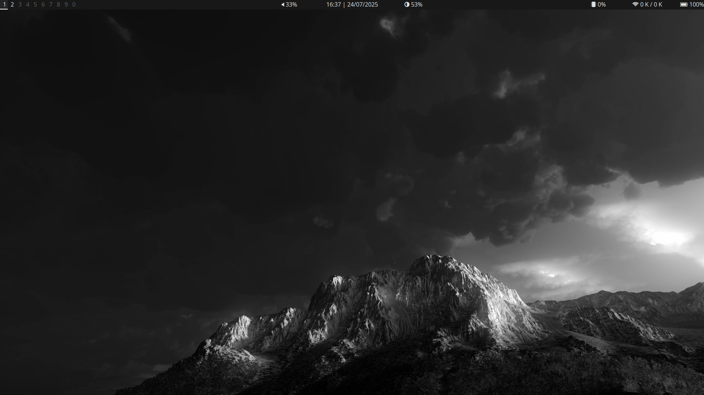
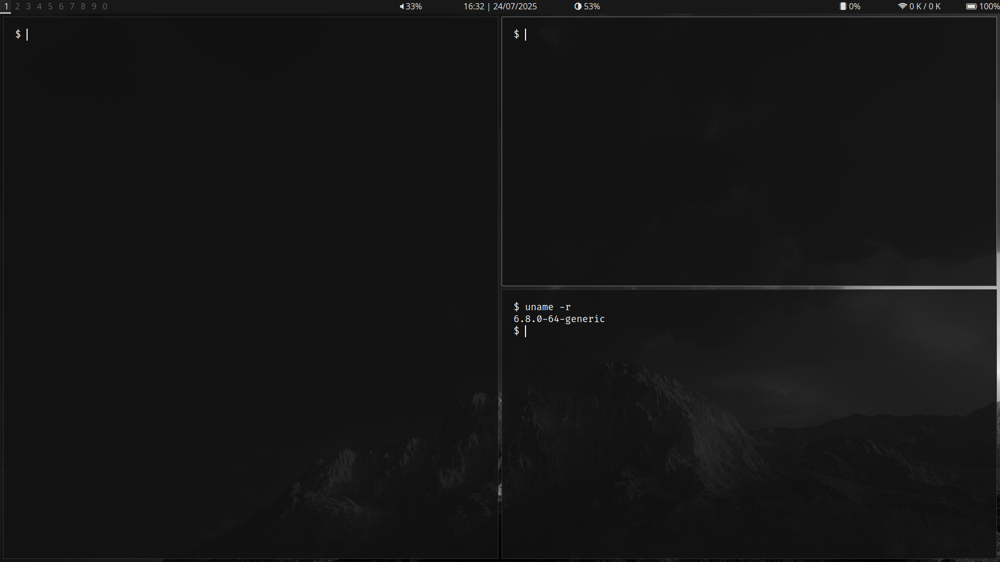
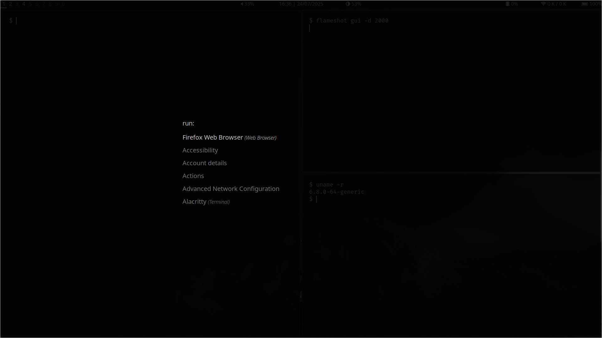

**Overview**  

A clean and distraction free bspwm rice. I've made this for personal use but feel free to use it.  
This rice uses bspwm, sxhkd, alacritty, polybar, dunst and rofi

**Installation:**

**1. Install dependencies:**  
  
**Debian:**  
```
sudo apt install fonts-noto fonts-firacode fonts-font-awesome alacritty bspwm sxhkd rofi polybar picom flameshot feh brightnessctl dunst
```  
  
**Fedora:**  
```
sudo dnf install google-noto-sans-fonts fira-code-fonts fontawesome5-fonts alacritty bspwm sxhkd rofi polybar picom flameshot feh brightnessctl dunst
```  
  
**Arch:**  
```
sudo pacman -S noto-fonts fira-code ttf-font-awesome alacritty bspwm sxhkd rofi polybar picom flameshot feh brightnessctl dunst
```  

**2. Clone and install**  
  
```
git clone https://github.com/1FIL0/NimbleDesktop.git
cd NimbleDesktop
./install.sh
./configure_x.sh
```
make sure to configure the correct platform

**Common Errors:**  

**No wifi module:**
The wifi module might not appear because it is configured for a specific interface. To fix this, change the variable [module/wireless-network]/interface in ~/.local/share/polybar/themes/nimbledesktop/modules.ini to your specific interface. To see your wifi interface, run ```ifconfig```  

**No backlight module:**
The backlight module might not appear either. To fix this, change the variable [module/backlight]/card in ~/.local/share/polybar/themes/nimbledesktop/modules.ini to your specific card. To see your card, run ```ls /sys/class/backlight```


